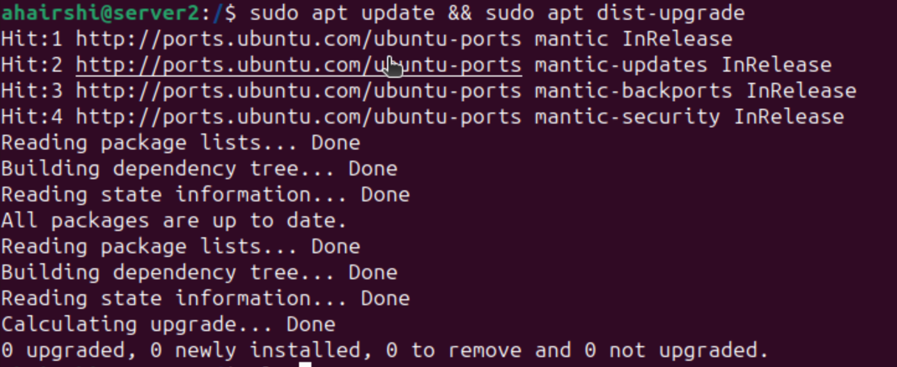
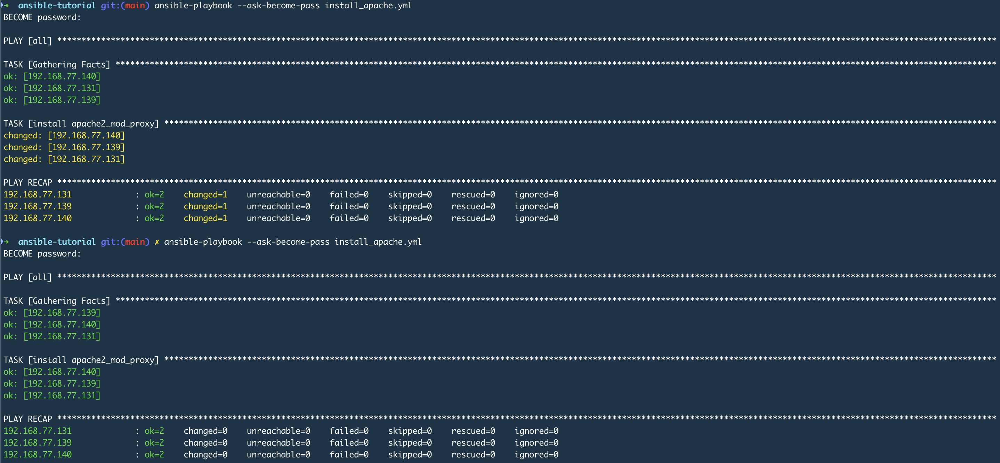

# ansible-tutorial

```

 ansible all -m apt -a update_cache=true --become --ask-become-pass
 ansible all -m apt -a name=vim-nox --become --ask-become-pass
 ansible all -m apt -a name=tmux --become --ask-become-pass
 ansible all -m apt -a name=vim-nox --become --ask-become-pass
 ansible all -m apt -a name=snapd --become --ask-become-pass
 ansible all -m apt -a "name=snapd state=latest" --become --ask-become-pass
 ansible all -m apt -a "upgrade=dist" --become --ask-become-pass
 ```

 

 