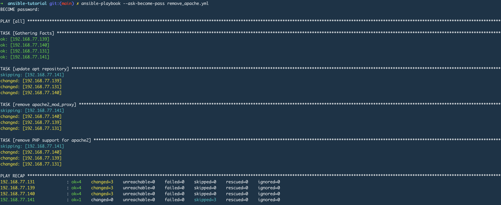
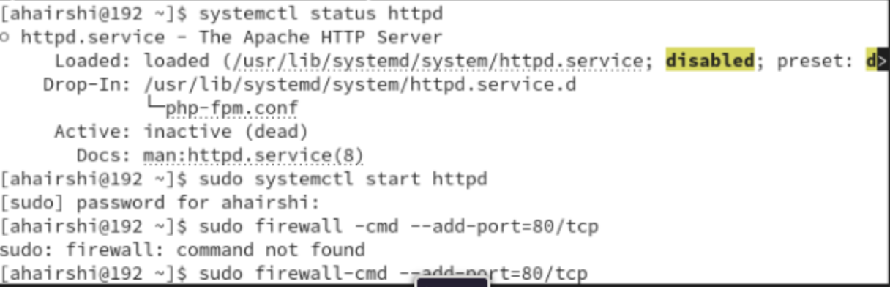

# ansible-tutorial

```

 ansible all -m apt -a update_cache=true --become --ask-become-pass
 ansible all -m apt -a name=vim-nox --become --ask-become-pass
 ansible all -m apt -a name=tmux --become --ask-become-pass
 ansible all -m apt -a name=vim-nox --become --ask-become-pass
 ansible all -m apt -a name=snapd --become --ask-become-pass
 ansible all -m apt -a "name=snapd state=latest" --become --ask-become-pass
 ansible all -m apt -a "upgrade=dist" --become --ask-become-pass
 ansible all -m ansible.builtin.gather_facts --limit 192.168.77.141 | grep ansible_distribution
 ansible-playbook --ask-become-pass remove_apache.yml
  ansible-playbook --ask-become-pass install_apache.yml
 ```

 

 

 

 ````
 ansible-tutorial git:(main) ✗ ansible-playbook --ask-become-pass install_apache.yml
BECOME password:

PLAY [all] *************************************************************************************************************************************************************************************************

TASK [Gathering Facts] *************************************************************************************************************************************************************************************
ok: [192.168.77.139]
ok: [192.168.77.140]
ok: [192.168.77.131]
ok: [192.168.77.141]

TASK [update apt repository - Ubuntu] **********************************************************************************************************************************************************************
skipping: [192.168.77.141]
changed: [192.168.77.140]
changed: [192.168.77.131]
changed: [192.168.77.139]

TASK [install apache2 package - Ubuntu] ********************************************************************************************************************************************************************
skipping: [192.168.77.141]
ok: [192.168.77.140]
ok: [192.168.77.139]
ok: [192.168.77.131]

TASK [add PHP support for apache2 - Ubuntu] ****************************************************************************************************************************************************************
skipping: [192.168.77.141]
ok: [192.168.77.140]
ok: [192.168.77.139]
ok: [192.168.77.131]

TASK [update apt repository - CentOS] **********************************************************************************************************************************************************************
skipping: [192.168.77.131]
skipping: [192.168.77.139]
skipping: [192.168.77.140]
ok: [192.168.77.141]

TASK [install apache2_mod_proxy - CentOS] ******************************************************************************************************************************************************************
skipping: [192.168.77.131]
skipping: [192.168.77.139]
skipping: [192.168.77.140]
changed: [192.168.77.141]

TASK [add PHP support for apache2 - CentOS] ****************************************************************************************************************************************************************
skipping: [192.168.77.131]
skipping: [192.168.77.139]
skipping: [192.168.77.140]
changed: [192.168.77.141]

PLAY RECAP *************************************************************************************************************************************************************************************************
192.168.77.131             : ok=4    changed=1    unreachable=0    failed=0    skipped=3    rescued=0    ignored=0
192.168.77.139             : ok=4    changed=1    unreachable=0    failed=0    skipped=3    rescued=0    ignored=0
192.168.77.140             : ok=4    changed=1    unreachable=0    failed=0    skipped=3    rescued=0    ignored=0
192.168.77.141             : ok=4    changed=2    unreachable=0    failed=0    skipped=3    rescued=0    ignored=0
```

